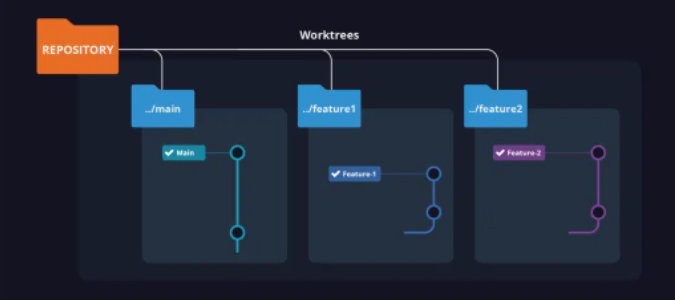

# git-worktree.md

## References
> - By default, Git only tracks and moves that pointer along on one branch at a time. The branch you selected with Git checkout is considered your “working tree”.
> - Just like a tree in the forest, a Git worktree can have several branches at once, which is exactly what the Git worktree command allows you to do.
> - To keep things organized, Git worktree places each branch into a different specified folder in your file system.  To move between the multiple branches on the worktree, you simply change directory to work against the needed branch.
>   - 
> - ...you can only ever have one working tree per directory.
> `git worktree list`: The output details include the path of each working tree, the commit hash, and the name of the branch currently checked out in that entry.
> - `git worktree add`: 
        - Add a new working tree to a directory that shares the same name as the branch (the most common method)
        - Add a new working tree to a directory with a different name as the branch
        - Create a new Git branch and add a new working tree to a directory that shares the same name as the branch
        - Create a new branch and add a new working tree to a directory with a different name as the new branch
source: [How to Use Git Worktree | Add, List, Remove](https://www.gitkraken.com/learn/git/git-worktree)

## Questions

## Notes
It is 2022 and how, just HOW did I not know about `git worktrees` until recently........?????!!!!! [[blog]]

## Resources
  - [This git worktree add example lets you never switch branches again - Coffee Talk: Java, News, Stories and Opinions](https://www.theserverside.com/blog/Coffee-Talk-Java-News-Stories-and-Opinions/Use-this-git-worktree-add-example-and-never-switch-branches-again)
  - [Practical Guide to Git Worktree - DEV Community](https://dev.to/yankee/practical-guide-to-git-worktree-58o0)
  - [Working on two git branches at once with git worktree](https://andrewlock.net/working-on-two-git-branches-at-once-with-git-worktree/)
  - [Git Worktrees: The Best Git Feature You’ve Never Heard Of | by James Pulec | Level Up Coding](https://levelup.gitconnected.com/git-worktrees-the-best-git-feature-youve-never-heard-of-9cd21df67baf)
  - [Local Operations on the Working Tree | Syntevo Documentation](https://docs.syntevo.com/SmartGit/21.2/Local-Operations-on-the-Working-Tree.html)